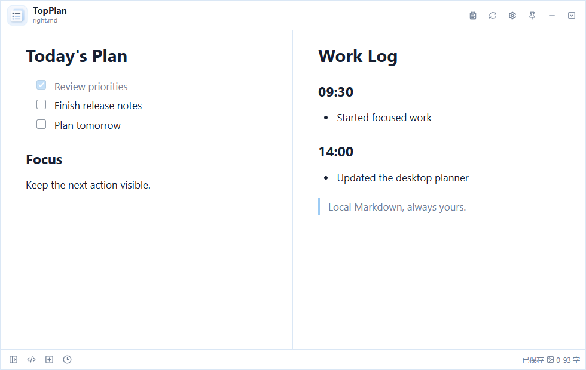

# TopPlan - Local-first Daily Planner

English | [简体中文](README.zh-CN.md)

[](https://github.com/haoiew/TopPlan/releases/latest)
[](LICENSE)

TopPlan is an open-source, local-first daily planner and Markdown task manager for today's plan, quick work notes, and visible desktop reminders. It keeps planning lightweight: no account, no cloud dependency, and no project-management setup before you can start writing.



**[Download the latest release](https://github.com/haoiew/TopPlan/releases/latest)**

## Why TopPlan

Many productivity tools are built around projects, teams, and databases. TopPlan is designed for a smaller, recurring job: decide what matters today, keep it visible while working, record progress, and carry unfinished tasks into the next workday.

- **Fast to start**: open one local Markdown file and begin planning.
- **Local-first and portable**: your `.md` files stay readable in any editor and remain under your control.
- **Present without taking over**: use a compact always-on-top window or taskbar-free mini notes.
- **Structured when useful**: enable workday files, automatic rollover, task hierarchy, or split view only when needed.

## Core Features

- Daily planning with `TopPlan.md` or workday files named `YYYY-MM-DD.md`.
- Workday-aware rollover for unfinished tasks, including Chinese statutory holidays and adjusted workdays.
- Rich-text and source Markdown editing with task lists, timestamps, links, code blocks, and local images.
- Parent-child task completion, visual indentation, and two-document split editing.
- Always-on-top frameless window, mini notes, opacity controls, and optional mouse click-through.
- Local image indexing and cleanup without uploading plan content to a remote service.

## Quick Start

1. Download and install TopPlan from [GitHub Releases](https://github.com/haoiew/TopPlan/releases/latest).
2. Select a local folder for your Markdown plan files on first launch.
3. Edit `TopPlan.md`, or enable workday files and start with today's plan.
4. Open an important file as a mini note when it should remain visible on the desktop.

The current release supports 64-bit Windows 10 and later. Microsoft Edge WebView2 Runtime is required and is already included with most current installations. The installer is unsigned, so the system may display an unknown publisher warning.

## Design Principles

TopPlan stays deliberately narrow: today's work should be visible, recording should be quick, and the files should outlive the app. Markdown is the long-term format of record, while the desktop application adds focused editing and daily workflow support without locking content into a proprietary data model.

## Data and Privacy

- The first launch asks for a local data folder; TopPlan does not require an account or cloud service.
- Existing Markdown files are used directly and are not migrated into a database.
- `.topplan/image-index.json` is a rebuildable local image index, not source data.
- The repository ignores local application data and personal Markdown files stored at the repository root.

## Feedback and Contributions

Bug reports, feature ideas, and focused pull requests are welcome in [GitHub Issues](https://github.com/haoiew/TopPlan/issues). If TopPlan is useful to you, starring the repository helps other people discover the project and lets you follow future releases.

## Development

TopPlan is built with Tauri 2, Svelte 5, TypeScript, CodeMirror 6, and TipTap.

```powershell
pnpm install
pnpm check
pnpm test:e2e
pnpm tauri build
```

Desktop builds require Rust, Microsoft C++ Build Tools, and WebView2 on Windows. Do not install project dependencies into the Miniforge base environment.

## Citation

Use GitHub's **Cite this repository** action to export TopPlan citation metadata in APA or BibTeX format. The citation data is maintained in [CITATION.cff](CITATION.cff).

## License and Attribution

TopPlan is available under the [Creative Commons Attribution 4.0 International](LICENSE) license. You may use, modify, and distribute it, including for commercial purposes.

When sharing a modified version or a product based on TopPlan, retain the attribution in [NOTICE](NOTICE): credit `TopPlan` by `Haoiew`, link to the project source and license, and clearly state any changes you made.
